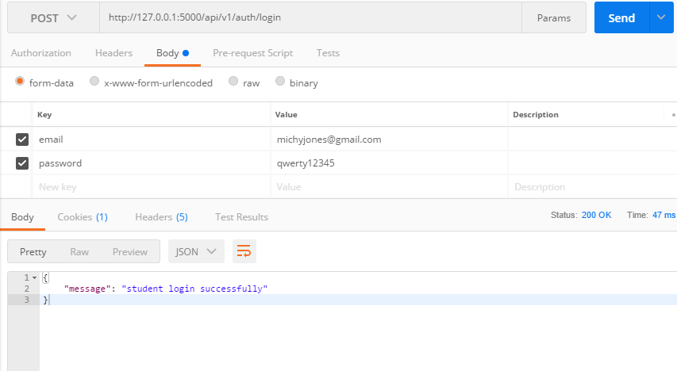

[](https://travis-ci.org/Michyjones/hello_books_API)
[](https://coveralls.io/github/Michyjones/hello_books_API?branch=master)

# hello_books_API
Hello_Books API is an application that helps manage a library and its processes like stocking, 
tracking and renting books. With this application users are able to find and rent books. The 
application also has an admin section where the admin can do things like add books, delete 
books and modify book information.

## Installation and setup

Clone the repository
```
https://github.com/Michyjones/hello_books_API.git
```

Go to the project root folder
```
cd hello_books_API
```
Install the requirements
```
pip install -r requirement.txt
```

Run the program , Interact with API by sending HTTP requests in Postman
```
pyhton run.py
```

## Testing 
Run application by 
```
nosetests --with-covarage
```
## Postman sample requests
Register User

Admin login

Student Login

Add Book


